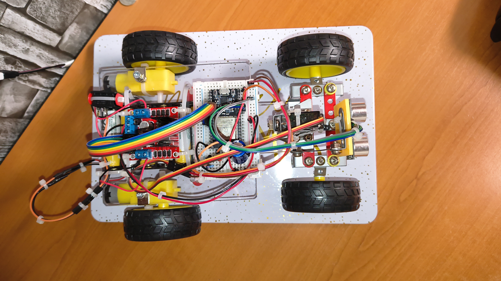
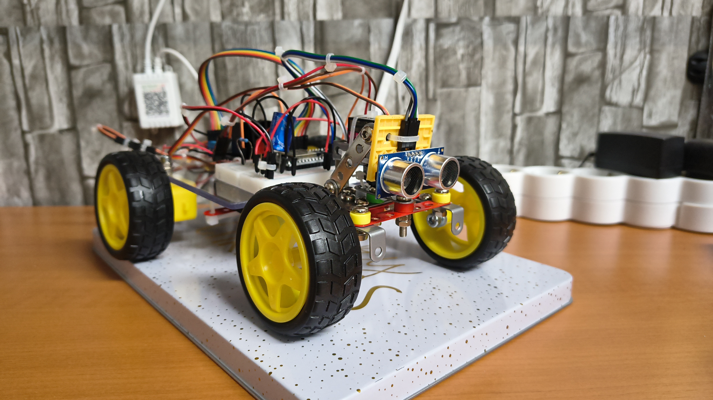
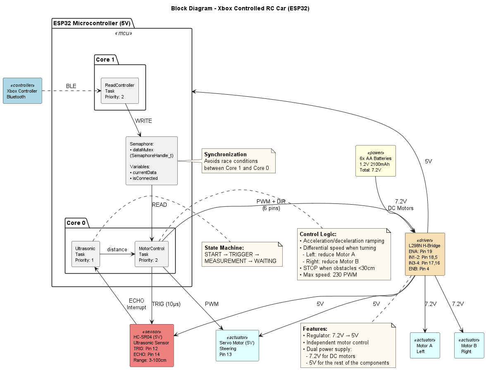

# 🚗 ESP32 Autonomous RC Car — Xbox Controller

An autonomous car controlled wirelessly via an **Xbox One controller over Bluetooth Low Energy (BLE)**, built around the **ESP32 dual-core microcontroller**. The car features real-time obstacle avoidance, Ackermann steering, differential drive, and smooth soft start/stop acceleration — all managed through FreeRTOS multi-tasking.

---

## 📸 Preview

<p align="center">
  
  &nbsp;
  
</p>

---

## 🎬 Demo Video

> Click the thumbnail below to watch the demo:

[](video.mp4)

> *(Or open `video.mp4` directly from this repository.)*

---

## 📐 System Architecture

<p align="center">
  
</p>

The system is split across both ESP32 cores for efficient parallel processing:

| Task | Core | Priority | Function |
|---|---|---|---|
| `readControllerTask` | 1 | 2 | Reads BLE data from the Xbox controller |
| `controlMotorsAndServo` | 0 | 2 | Controls motors, servo & obstacle avoidance |
| `ultrasonicTask` | 0 | 1 | Periodic ultrasonic distance measurements |

A **FreeRTOS mutex** (`dataMutex`) protects the shared `currentData` (XboxControlsState) and `isConnected` variables between cores.

---

## ✨ Features

- **Wireless Control** — Xbox One controller via Bluetooth Low Energy (BLE)
- **Autonomous Obstacle Avoidance** — HC-SR04 ultrasonic sensor with hardware interrupt; full stop at < 30 cm in forward direction
- **Ackermann Steering** — Custom servo-actuated steering mechanism for realistic car-like turning
- **Differential Drive** — Inner wheel speed reduced by up to 30% during turns for smooth cornering
- **Soft Start/Stop** — Gradual acceleration and deceleration to protect components and reduce mechanical shock
- **Dual-Core Multi-Tasking** — FreeRTOS tasks distributed across both ESP32 cores for responsive, non-blocking operation
- **Reverse Always Available** — Obstacle avoidance only blocks forward movement; reversing is always permitted to escape stuck situations

---

## 🔧 Hardware Components

| Component | Specifications | Qty |
|---|---|---|
| Microcontroller | NodeMCU-32S-38 (ESP32 dual-core, 240 MHz) | 1 |
| Motor Driver | L298N Dual H-Bridge (integrated 5V regulator) | 1 |
| DC Motors | 3V–6V with 1:48 gearbox | 2 |
| Servo Motor | MG90S (metal gears) | 1 |
| Distance Sensor | HC-SR04 Ultrasonic (3–400 cm) | 1 |
| Wheels | Ø65mm rubber wheels | 4 |
| Power Supply | 6× AA NiMH 1.2V, 2100mAh | 1 set |
| Ceramic Capacitor | 100 nF, 50V (noise filtering) | 2 |
| Electrolytic Capacitor | 1000 µF, 25V (voltage stabilization) | 1 |
| Power Switch | On/Off switch | 1 |
| Controller | Xbox One (BLE) | 1 |

### Power Distribution
```
6× AA NiMH → 7.2V nominal (8.4V fully charged)
    ├── 7.2V ──→ DC Motors (via L298N)
    └── L298N 5V regulator ──→ ESP32 + Servo + HC-SR04
```

---

## 📌 Pin Mapping

| ESP32 Pin | Connected To |
|---|---|
| GPIO 13 | Servo MG90S — Signal (PWM) |
| GPIO 19 | L298N ENA — Motor A PWM |
| GPIO 18 | L298N IN1 |
| GPIO 5 | L298N IN2 |
| GPIO 17 | L298N IN3 |
| GPIO 16 | L298N IN4 |
| GPIO 4 | L298N ENB — Motor B PWM |
| GPIO 12 | HC-SR04 TRIG |
| GPIO 14 | HC-SR04 ECHO (hardware interrupt) |

| L298N Output | Connected To |
|---|---|
| OUT1, OUT2 | Motor A (Left) |
| OUT3, OUT4 | Motor B (Right) |
| +12V input | Battery pack 7.2V (via switch) |
| +5V output | ESP32, HC-SR04, Servo |

---

## 🎮 Xbox Controller Mapping

| Control | Function |
|---|---|
| Left Stick X-axis | Steering (left/right) → servo angle |
| Right Trigger | Forward acceleration (0–100% → 0–230 PWM) |
| Left Trigger | Reverse (0–100% → 0–230 PWM) |

---

## 💻 Software Algorithms

### Soft Start / Stop

Gradual ramping prevents mechanical shock, sudden current spikes, and protects the L298N's 5V regulator:
```cpp
const int RAMP_STEP = 10;
if (currentSpeed < targetSpeed) {
    currentSpeed = min(currentSpeed + RAMP_STEP, targetSpeed);
} else if (currentSpeed > targetSpeed) {
    currentSpeed = max(currentSpeed - RAMP_STEP, targetSpeed);
}
```

### Differential Steering

The inner wheel is slowed by up to 30% during a turn, reducing turning radius and improving cornering precision:
```cpp
if (steerFactor < -0.1) {
    // Turn LEFT — slow down left motor
    targetSpeedLeft  = targetSpeedBase * (1.0 - abs(steerFactor) * 0.3);
    targetSpeedRight = targetSpeedBase;
} else if (steerFactor > 0.1) {
    // Turn RIGHT — slow down right motor
    targetSpeedLeft  = targetSpeedBase;
    targetSpeedRight = targetSpeedBase * (1.0 - abs(steerFactor) * 0.3);
}
```

### Obstacle Avoidance
```cpp
if (isForward && distance < WARNING_DISTANCE) {
    targetSpeedBase = 0; // Full stop at < 30 cm
}
```

Reverse is unaffected — the car can always back out of a blocked situation.

### Ultrasonic Sensor State Machine

The HC-SR04 operates through a 4-state cycle driven by a hardware interrupt on the ECHO pin:
```
START → TRIGGER (10µs pulse) → MEASUREMENT (wait for interrupt) → WAITING (100ms pause) → START
```

---

## 🛠️ Getting Started

### Prerequisites

- [Arduino IDE]
- ESP32 board support package installed
- Libraries:
  - `BLE-Gamepad-Client by Tomasz Bekas`
  - `ESP32Servo by Kevin Harrington, John K. Bennett`
  - FreeRTOS (included with ESP32 Arduino core)

### Installation

1. **Clone the repository:**

2. **Open the sketch** in Arduino IDE:
```
   ESP32-Car-Controlled-By-Xbox-Controller.ino
```

3. **Select the correct board:**
   - Tools → Board → `NodeMCU-32S` (or `ESP32 Dev Module`)
   - Tools → Partition Scheme → `Default`

4. **Install required libraries** via the Library Manager or manually.

5. **Upload** the sketch to your ESP32.

6. **Pair the Xbox controller:**
   - Hold the Xbox button + sync button on the controller until it blinks rapidly
   - Power on the car — the ESP32 will auto-connect via BLE

---

## 🏆 Results & Conclusions

The project successfully demonstrates:

- **Responsive wireless control** with low latency thanks to BLE and dual-core architecture
- **Reliable safety** through autonomous obstacle detection and stopping
- **Precise maneuverability** combining Ackermann steering with differential speed control
- **Component protection** via soft start/stop reducing mechanical and electrical stress
- **Efficient multi-tasking** using FreeRTOS to maximize ESP32 resource utilization

---
